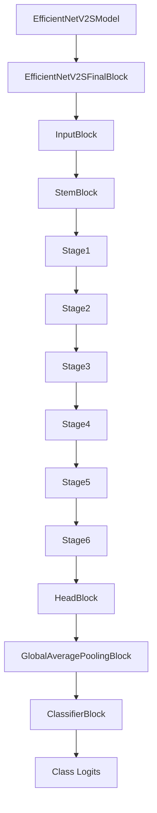

# EfficientNetV2-S Architecture

This diagram shows how the modular code calls each class during a forward pass.

## High-Level Call Flow



## Full Block Order

```mermaid
flowchart TD
    Input[Input image<br/>B x 3 x 64 x 64] --> InputBlock
    InputBlock --> Stem[StemBlock<br/>3x3 Conv, stride 2<br/>24 channels]

    Stem --> S1[Stage1<br/>FusedMBConv x2<br/>24 channels]
    S1 --> B1[FusedMBConvBlock1]
    B1 --> B2[FusedMBConvBlock2]

    B2 --> S2[Stage2<br/>FusedMBConv x4<br/>48 channels]
    S2 --> B3[FusedMBConvBlock3<br/>stride 2]
    B3 --> B4[FusedMBConvBlock4]
    B4 --> B5[FusedMBConvBlock5]
    B5 --> B6[FusedMBConvBlock6]

    B6 --> S3[Stage3<br/>FusedMBConv x4<br/>64 channels]
    S3 --> B7[FusedMBConvBlock7<br/>stride 2]
    B7 --> B8[FusedMBConvBlock8]
    B8 --> B9[FusedMBConvBlock9]
    B9 --> B10[FusedMBConvBlock10]

    B10 --> S4[Stage4<br/>MBConvSE x6<br/>128 channels]
    S4 --> B11[MBConvSEBlock11<br/>stride 2]
    B11 --> B12[MBConvSEBlock12]
    B12 --> B13[MBConvSEBlock13]
    B13 --> B14[MBConvSEBlock14]
    B14 --> B15[MBConvSEBlock15]
    B15 --> B16[MBConvSEBlock16]

    B16 --> S5[Stage5<br/>MBConvSE x9<br/>160 channels]
    S5 --> B17[MBConvSEBlock17]
    B17 --> B18[MBConvSEBlock18]
    B18 --> B19[MBConvSEBlock19]
    B19 --> B20[MBConvSEBlock20]
    B20 --> B21[MBConvSEBlock21]
    B21 --> B22[MBConvSEBlock22]
    B22 --> B23[MBConvSEBlock23]
    B23 --> B24[MBConvSEBlock24]
    B24 --> B25[MBConvSEBlock25]

    B25 --> S6[Stage6<br/>MBConvSE x15<br/>256 channels]
    S6 --> B26[MBConvSEBlock26<br/>stride 2]
    B26 --> B27[MBConvSEBlock27]
    B27 --> B28[MBConvSEBlock28]
    B28 --> B29[MBConvSEBlock29]
    B29 --> B30[MBConvSEBlock30]
    B30 --> B31[MBConvSEBlock31]
    B31 --> B32[MBConvSEBlock32]
    B32 --> B33[MBConvSEBlock33]
    B33 --> B34[MBConvSEBlock34]
    B34 --> B35[MBConvSEBlock35]
    B35 --> B36[MBConvSEBlock36]
    B36 --> B37[MBConvSEBlock37]
    B37 --> B38[MBConvSEBlock38]
    B38 --> B39[MBConvSEBlock39]
    B39 --> B40[MBConvSEBlock40]

    B40 --> Head[HeadBlock<br/>1x1 Conv<br/>1280 channels]
    Head --> Pool[GlobalAveragePoolingBlock<br/>B x 1280 x 1 x 1]
    Pool --> Classifier[ClassifierBlock<br/>Dropout + Linear]
    Classifier --> Output[Output logits<br/>B x num_classes]
```



## Stage Summary

| Code stage | Block type | Blocks | Output channels | Downsample block |
|---|---:|---:|---:|---|
| `StemBlock` | Conv-BN-SiLU | 1 | 24 | yes, stride 2 |
| `Stage1` | FusedMBConv | 2 | 24 | no |
| `Stage2` | FusedMBConv | 4 | 48 | `FusedMBConvBlock3` |
| `Stage3` | FusedMBConv | 4 | 64 | `FusedMBConvBlock7` |
| `Stage4` | MBConv + SE | 6 | 128 | `MBConvSEBlock11` |
| `Stage5` | MBConv + SE | 9 | 160 | no |
| `Stage6` | MBConv + SE | 15 | 256 | `MBConvSEBlock26` |
| `HeadBlock` | 1x1 Conv-BN-SiLU | 1 | 1280 | no |
| `ClassifierBlock` | Dropout + Linear | 1 | `num_classes` | no |

## Tiny ImageNet Tensor Shapes

For input shape `B x 3 x 64 x 64`:

| Step | Output shape |
|---|---|
| `InputBlock` | `B x 3 x 64 x 64` |
| `StemBlock` | `B x 24 x 32 x 32` |
| `Stage1` | `B x 24 x 32 x 32` |
| `Stage2` | `B x 48 x 16 x 16` |
| `Stage3` | `B x 64 x 8 x 8` |
| `Stage4` | `B x 128 x 4 x 4` |
| `Stage5` | `B x 160 x 4 x 4` |
| `Stage6` | `B x 256 x 2 x 2` |
| `HeadBlock` | `B x 1280 x 2 x 2` |
| `GlobalAveragePoolingBlock` | `B x 1280 x 1 x 1` |
| `ClassifierBlock` | `B x num_classes` |

## Where Stochastic Depth Happens

Each residual block has:

```text
main path output -> stochastic_depth -> add identity
```

This only applies when the block has a valid skip connection. Downsampling blocks do not use the skip connection.

The drop-path schedule is created in `EfficientNetV2SFinalBlock`:

```text
40 blocks total
drop_path_rate increases linearly from 0.0 to final drop_path_rate
default final drop_path_rate = 0.2 in the model, 0.1 in the training script
```

