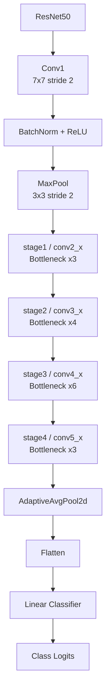
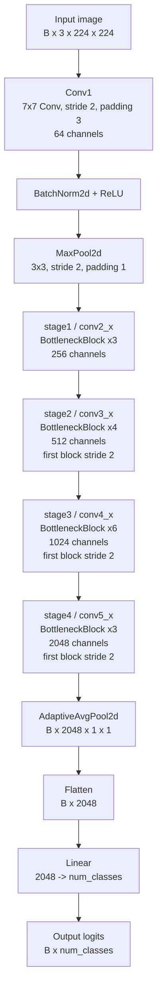

# Standard ResNet-50 Architecture

This folder is aligned around the active implementation in `model.py`.
The active model is a standard ImageNet-style ResNet-50 backbone with a
configurable classifier head. For Tiny ImageNet training, the classifier uses
`num_classes=200`, while the input preprocessing upsizes images to the standard
224x224 ResNet input size.

The files `Stage1.py` to `Stage4.py` and `ResidualBlock1.py` to
`ResidualBlock16.py` are explicit legacy/reference blocks. They are not used by
`model.py`. The real forward path uses `BottleneckBlock` and `_make_stage`.

## High-Level Call Flow



## Full Block Order



## Stage Summary

| Code stage | ResNet name | Blocks | Output channels | Spatial stride |
|---|---:|---:|---:|---:|
| `conv1 + bn1 + relu + maxpool` | stem | 1 | 64 | 4 |
| `stage1` | `conv2_x` | 3 | 256 | 4 |
| `stage2` | `conv3_x` | 4 | 512 | 8 |
| `stage3` | `conv4_x` | 6 | 1024 | 16 |
| `stage4` | `conv5_x` | 3 | 2048 | 32 |
| `avgpool + fc` | classifier | 1 | `num_classes` | no |

## Standard 224x224 Tensor Shapes

For input shape `B x 3 x 224 x 224`:

| Step | Output shape |
|---|---|
| `conv1` | `B x 64 x 112 x 112` |
| `bn1 + relu` | `B x 64 x 112 x 112` |
| `maxpool` | `B x 64 x 56 x 56` |
| `stage1` | `B x 256 x 56 x 56` |
| `stage2` | `B x 512 x 28 x 28` |
| `stage3` | `B x 1024 x 14 x 14` |
| `stage4` | `B x 2048 x 7 x 7` |
| `AdaptiveAvgPool2d` | `B x 2048 x 1 x 1` |
| `Flatten` | `B x 2048` |
| `fc` | `B x num_classes` |

## Inside Each Bottleneck Block

Each residual block uses a ResNet bottleneck pattern:

```text
main path:
1x1 Conv -> BatchNorm -> ReLU
3x3 Conv -> BatchNorm -> ReLU
1x1 Conv -> BatchNorm

skip path:
identity, or projection Conv + BatchNorm when shape changes

output:
main path + skip path -> ReLU
```

In the active `BottleneckBlock`, downsampling stride is applied in the first
`1x1` convolution of a downsampling block, with the same stride applied to the
projection shortcut.

Downsampling/projection points:

```text
stage1 first block: 64 -> 256, stride 1 projection
stage2 first block: 256 -> 512, stride 2 projection
stage3 first block: 512 -> 1024, stride 2 projection
stage4 first block: 1024 -> 2048, stride 2 projection
```
